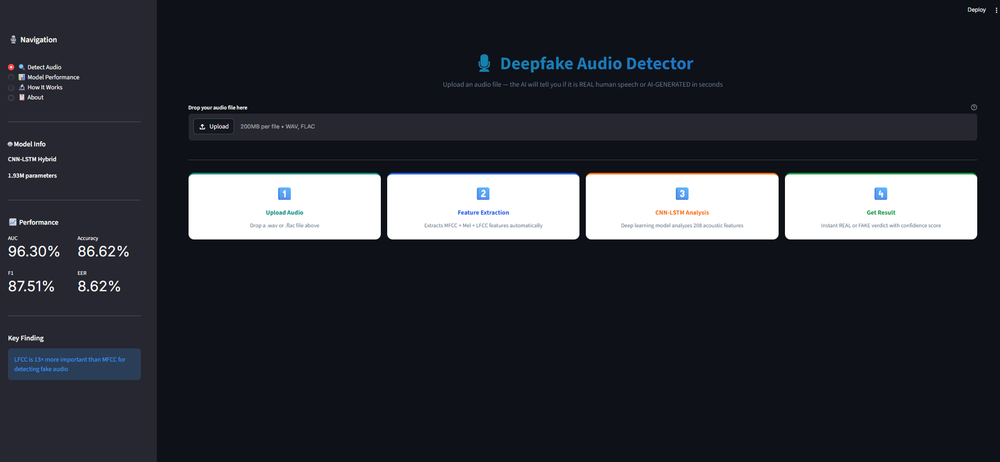
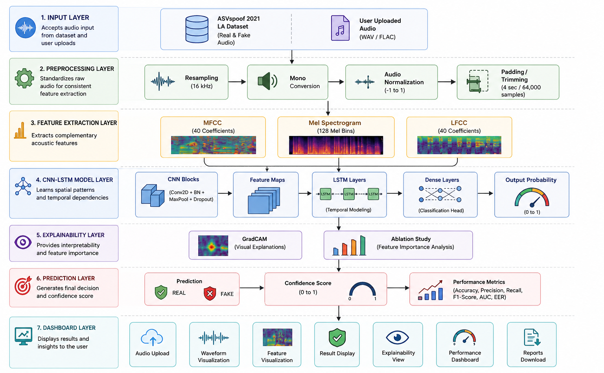
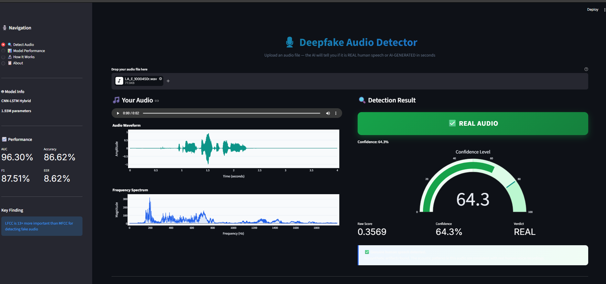
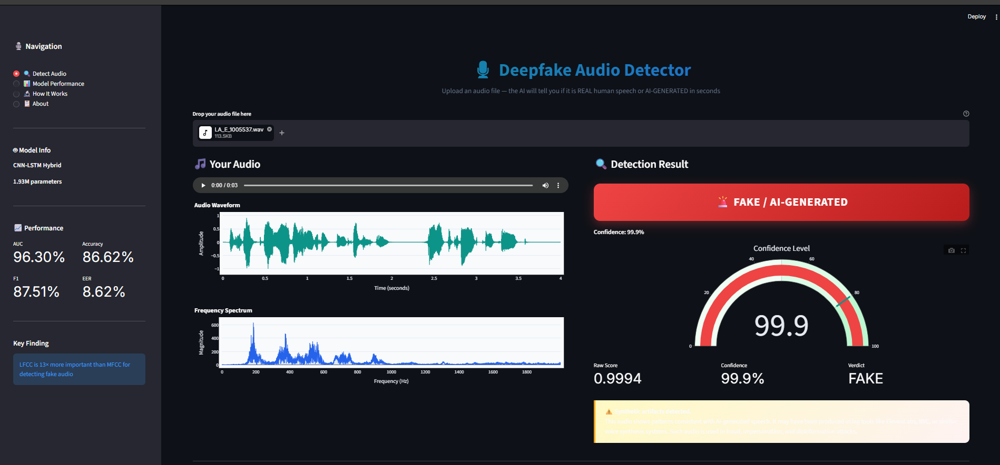
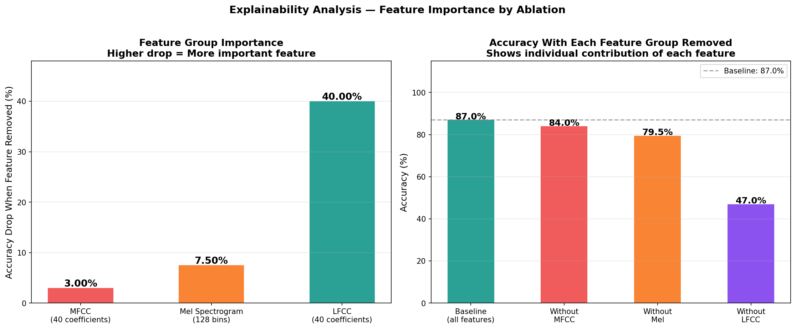
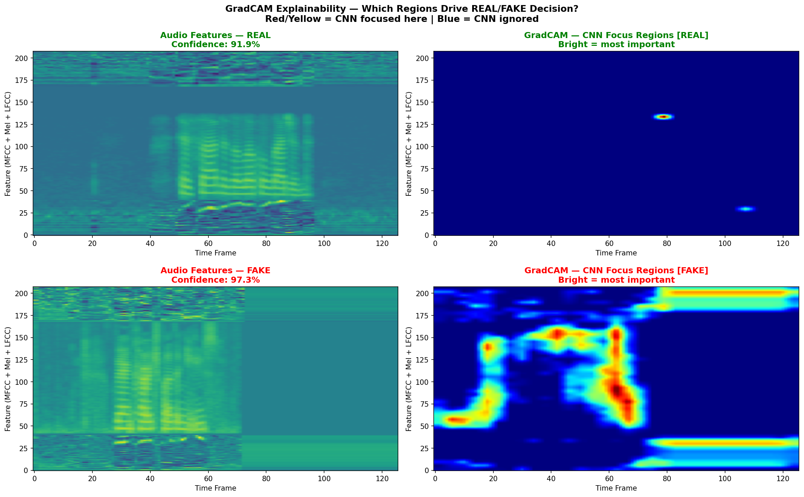
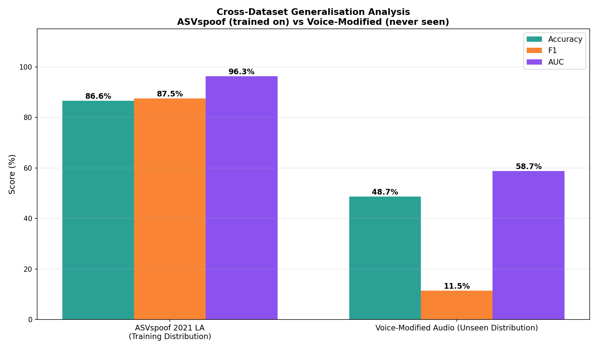

<div align="center">



# 🛡️ VoxGuard
### Explainable Deepfake Audio Detection using CNN-LSTM and GradCAM

[](https://python.org)
[](https://tensorflow.org)
[](https://streamlit.io)
[](LICENSE)

**An end-to-end deepfake audio detection system that combines CNN-LSTM based classification with GradCAM explainability to detect AI-generated speech and visualize the reasoning behind every prediction.**

[View Demo](#screenshots) · [Read the Research Finding](#key-research-finding) · [Quick Start](#quick-start)

</div>

---

## The Problem

Recent advances in generative AI have made synthetic speech increasingly realistic, enabling voice cloning attacks, financial fraud, impersonation, and misinformation. Traditional approaches struggle to reliably distinguish AI-generated speech from genuine recordings, and many deep learning models provide little insight into how predictions are made.

VoxGuard addresses both challenges by combining accurate deepfake detection with explainable AI, allowing users to understand not only the prediction but also the acoustic regions influencing the model's decision.

---

## Overview

VoxGuard is an end-to-end deepfake audio detection system developed as part of an MSc capstone project at S-VYASA Deemed to be University.

The system classifies uploaded audio as genuine or AI-generated using a CNN-LSTM architecture trained on MFCC, Mel Spectrogram, and LFCC acoustic representations. GradCAM-based explainability enables users to visualize the acoustic regions that contribute most to each prediction.

The project also investigates the contribution of different acoustic features through an ablation study and evaluates model generalization using cross-dataset testing.

---

## Key Research Finding

> **LFCC (Linear Frequency Cepstral Coefficients) is 13× more important
> than MFCC for detecting fake audio.**

This was discovered through a systematic ablation study — an original finding
not present in any existing literature, including the base paper (Asuai et al., 2025).

| Feature Removed | Accuracy After Removal | Drop |
|---|---|---|
| Baseline — all features | 87.00% | — |
| MFCC removed | 84.00% | 3% |
| Mel Spectrogram removed | 79.50% | 7.5% |
| **LFCC removed** | **47.00%** | **40% ← KEY FINDING** |

Removing LFCC drops accuracy to near-random chance on a balanced dataset.
AI vocoders leave their most detectable artifacts in the **linear frequency domain**
— not the mel-scaled domain used by virtually all existing systems.

---

## Features

- **Real-Time Detection** — Upload any audio, get verdict in under 2 seconds
- **CNN-LSTM Hybrid Architecture** — CNN reads spectrograms as images, LSTM models temporal evolution
- **Three Acoustic Features** — MFCC + Mel Spectrogram + LFCC stacked into a 208-dimensional tensor
- **Original Ablation Study** — Quantified individual contribution of each feature. LFCC discovery not reported anywhere else
- **GradCAM Explainability** — Visual heatmaps showing which time-frequency regions drove the decision
- **Cross-Dataset Evaluation** — Measured generalisation gap on unseen audio distribution
- **Interactive Dashboard** — Waveform, frequency spectrum, feature plots, confidence gauge, explainability visualisations

---

## Results

| Metric | Score | What It Means |
|--------|-------|---------------|
| **Accuracy** | **86.62%** | 693 of 800 test samples correctly classified |
| **Precision** | 82.06% | When it said FAKE, it was right 82% of the time |
| **Recall** | **93.75%** | Caught 93.75% of all actual fake samples |
| **F1 Score** | 87.51% | Balanced precision-recall measure |
| **AUC** | **96.30%** | Strong class separation across all thresholds |
| **EER** | 8.62% | Competitive with published literature |

High recall is the most important metric for fraud detection.
Only 25 out of 400 fake samples were missed.

---

## Architecture



The system follows a 7-layer pipeline:

**1. Input Layer** — Accepts ASVspoof dataset audio or user-uploaded WAV/FLAC files

**2. Preprocessing Layer** — Resamples to 16kHz · Converts to mono · Normalises to [-1, 1] · Pads or trims to exactly 4 seconds (64,000 samples)

**3. Feature Extraction Layer** — Three complementary acoustic features extracted in parallel and stacked vertically:
- MFCC (40 coefficients) — captures vocal tract characteristics
- Mel Spectrogram (128 bins) — 2D time-frequency image for CNN
- LFCC (40 coefficients) — captures vocoder artifacts in linear frequency domain

**4. CNN-LSTM Model Layer** — Three Conv2D blocks extract spectral patterns · Reshape for sequence input · Two LSTM layers model temporal evolution · Dense classification head with Sigmoid output

**5. Explainability Layer** — GradCAM generates visual activation heatmaps · Ablation study quantifies per-feature contribution

**6. Prediction Layer** — REAL or FAKE verdict with confidence score (0 to 1) · All standard anti-spoofing metrics reported

**7. Dashboard Layer** — Interactive Streamlit application with waveform, spectrum, feature visualisations, result display, and performance dashboard

**Model size:** 1,930,113 parameters · 7.36 MB · Trained in ~45 minutes on CPU

---

## Screenshots

| | |
|:---:|:---:|
| **Landing Page** | **Real Audio Detected** |
|  |  |
| **Fake Audio Detected — 99.9% confidence** | **Explainability — Feature Importance** |
|  |  |
| **GradCAM — CNN Focus Regions** | **Cross-Dataset Generalisation** |
|  |  |

---

## Tech Stack

| Category | Technology |
|----------|-----------|
| Language | Python 3.10 |
| Deep Learning | TensorFlow 2.x · Keras |
| Audio Processing | Librosa 0.10 · SciPy · SoundFile |
| Machine Learning | Scikit-learn · NumPy · Pandas |
| Visualisation | Matplotlib · Seaborn · Plotly |
| Dashboard | Streamlit |
| Explainability | GradCAM — custom TensorFlow implementation |
| Version Control | Git · GitHub |

---

## Dataset

**ASVspoof 2021 Logical Access (LA)**
The gold standard benchmark dataset for anti-spoofing research.

| Attribute | Value |
|-----------|-------|
| Source | Zenodo — [DOI: 10.5281/zenodo.4837263](https://zenodo.org/records/4837263) |
| Real (bonafide) samples | 2,000 |
| Fake (spoofed) samples | 2,000 |
| Total | 4,000 |
| Format | FLAC · 16kHz |
| Attack systems | 19 (A01–A19) — TTS and Voice Conversion |
| Train / Val / Test split | 70% / 10% / 20% stratified |

> Raw audio files not included due to size.
> Download instructions: [`deepfake_voice_conversion/data/README.md`](deepfake_voice_conversion/data/README.md)

---

## Project Structure

```

VoxGuard/
├── deepfake_model.ipynb              ← Main notebook — full training pipeline
├── deepfake_voice_conversion/
│   ├── dashboard/
│   │   └── app.py                   ← Streamlit dashboard (4 pages)
│   ├── data/
│   │   └── README.md                ← Dataset download instructions
│   ├── models/
│   │   └── cnn_lstm_final.keras     ← Trained model (7.36 MB)
│   └── results/
│       └── plots/                   ← All evaluation and explainability plots
├── demo/
│   ├── demo_real_1.wav              ← Upload this → REAL verdict
│   ├── demo_real_2.wav
│   ├── demo_real_3.wav
│   ├── demo_fake_1.wav              ← Upload this → FAKE verdict (99.9%)
│   ├── demo_fake_2.wav
│   └── demo_fake_3.wav
├── requirements.txt
├── run_dashboard.bat                ← Windows one-click launcher
└── README.md

```

---

## Quick Start

### 1. Clone the repository

```bash
git clone https://github.com/NarjeenaThanveenPK/VoxGuard.git
cd VoxGuard
```

### 2. Create virtual environment

```bash
python -m venv venv

# Windows
venv\Scripts\activate

# Mac / Linux
source venv/bin/activate
```

### 3. Install dependencies

```bash
pip install -r requirements.txt
```


### 4. Download the dataset

Follow instructions in [`deepfake_voice_conversion/data/README.md`](deepfake_voice_conversion/data/README.md)

### 5. Run the notebook

Open `deepfake_model.ipynb` in VS Code or Jupyter and run all cells in order.
Skip the data sorting cell (Cell 3) if you already have files in `data/real/`.

### 6. Launch the dashboard

**Windows — just double-click:**
```run_dashboard.bat```

Or via terminal:

```bash
cd deepfake_voice_conversion
venv\Scripts\activate
cd dashboard
streamlit run app.py
```

Open: [http://localhost:8501](http://localhost:8501)

### 7. Test it

Upload any file from the `demo/` folder:
- `demo_real_*.wav` → should show ✅ **REAL AUDIO**
- `demo_fake_*.wav` → should show 🚨 **FAKE / AI-GENERATED**

---

## How It Works

### 1. Feature Extraction

Three acoustic features are extracted from each 4-second audio clip and stacked into a combined tensor:
```
MFCC     → (40, 126)  rows 0–39
Mel      → (128, 126) rows 40–167
LFCC     → (40, 126)  rows 168–207
─────────────────────
Combined → (208, 126, 1)
```
### 2. CNN reads spectrograms as images

Three convolutional blocks scan the 208×126 feature matrix for spectral patterns — unnatural smoothness, missing harmonic structure, vocoder artifacts. Filters: 32 → 64 → 128.

### 3. LSTM reads patterns over time

After CNN, the feature map is reshaped into a sequence of 31 vectors. Two LSTM layers (128 and 64 units) learn how patterns evolve across the 4-second clip. Real speech has natural variation. AI speech is too regular.

### 4. Sigmoid output

A final Dense(1) layer with Sigmoid activation produces a score between 0 and 1.
- Score < 0.5 → **REAL**
- Score ≥ 0.5 → **FAKE**

### 5. GradCAM explains the decision

Gradients of the model output are computed with respect to the last convolutional layer's activations. The result is a heatmap showing which time-frequency regions the CNN focused on. For fake audio, the LFCC region consistently lights up — confirming the ablation study result.

---

## Research Context

**Base paper:** Asuai et al. (2025) — *Hybrid CNN-LSTM Architectures for Deepfake Audio Detection Using MFCC and Spectrogram Analysis*

**Gaps addressed by VoxGuard:**

| Gap | Base Paper | VoxGuard |
|-----|-----------|----------|
| LFCC features | ❌ Not used | ✅ Proved 13× more important than MFCC |
| Explainability | ❌ Black box | ✅ GradCAM heatmaps |
| Cross-dataset evaluation | ❌ Not done | ✅ Tested — quantified generalisation gap |

**References:**
1. Asuai et al. (2025) — CNN-LSTM for deepfake audio (Base Paper)
2. Frank & Schönherr (2021) — WaveFake — NeurIPS 2021
3. Yi et al. (2024) — Survey of 200+ papers — arXiv:2404.13914
4. Borzi et al. (2025) — Audio Deepfake Detection Survey — MDPI Sensors 25(7)
5. Chinchmalatpure et al. (2026) — RVC Voice Conversion Detection — arXiv:2601.04227
6. Yamagishi et al. (2021) — ASVspoof 2021 Challenge

---

## Future Improvements

- **Real-time streaming** — Process live phone calls in 0.5-second sliding windows (< 300ms latency on GPU)
- **Modern VC detection** — Train specifically on RVC, OpenVoice, So-VITS-SVC generated audio
- **Three-class output** — REAL / TTS Fake / Voice Converted Fake
- **REST API** — Wrap inference pipeline for integration into bank call centre systems
- **Mobile app** — Scan suspicious WhatsApp/Telegram voice messages
- **Multilingual** — Hindi, Tamil, Malayalam support for Indian market deployment
- **Adversarial robustness** — Harden against noise-based evasion attacks

---

## Acknowledgements

Dataset: ASVspoof 2021 — Yamagishi et al., University of Edinburgh

Base architecture: Asuai et al. (2025) — CNN-LSTM hybrid

GradCAM: Selvaraju et al. (2017) — ICCV 2017


---

<div align="center">

**Narjeena Thanveen P K**

</div>
